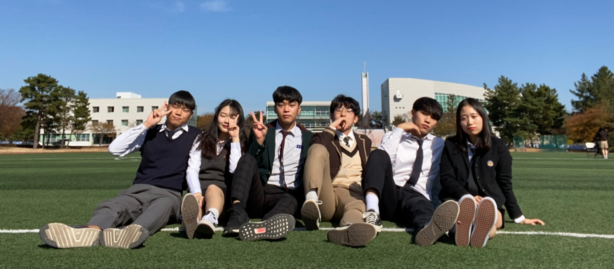

# UNBAP

## 언밥(UNBAP) 소개

### **언밥하다** \[언:밥하다\]

1. **동사** 코딩을 찰지게 잘하다
2. **동사** 아이디어가 쫀쫀해 따라올자가 없다

**언밥**은 한동대학교 20학번 컴퓨터공학심화 전공 6명으로 구성된 팀으로써 프로젝트를 바탕으로 이론적 지식을 탄탄히 다지고 실무 능력 증진을 이루는 것을 목적으로 하고 있습니다.

### 저희 언밥에서 진행하는 프로젝트는 다음과 같습니다.

#### 1. 언밥 홈페이지 웹 구축 (2020. 02. 22 - )

참여 멤버 : 유정섭, 전소명, 최혜림, 홍석찬

---

## 멤버 설명

### 유정섭

성년월일 : 2000.02.10.\
이메일 : 22000462@handong.edu\
학력 : 한동대 컴퓨터공학심화\
\- SW 페스티벌 1학년 자작 소프트웨어 부문 대상\
\- C 프로그래밍 컨테스트 부문 최우수상

### 임정현

생년월일 : 2001.03.09.\
이메일 : 22000770@handong.edu\
학력 : 한동대 컴퓨터공학심화

### 최혜림

생년월일 : 2001.08.30.\
이메일 : 22000770@handong.edu\
학력 : 한동대 컴퓨터공학심화\
\- SW 페스티벌 1학년 자작 소프트웨어 부문 최우수상\
\- 1학년 C 프로그래밍 컨테스트 부문 장려상

### 전소명

생년월일 : 2001.10.17.\
이메일 : 22000646@handong.edu\
학력 : 한동대 컴퓨터공학심화\
\- SW 페스티벌 1학년 자작 소프트웨어 부문 최우수상\
\- 1학년 C 프로그래밍 컨테스트 부문 최우수상

### 정주영

생년월일 : 2001.11.04.\
이메일 : 22000694@handong.edu\
학력 : 한동대 컴퓨터공학심화\
\- SW 페스티벌 1학년 자작 소프트웨어 부문 대상

### 홍석찬

성년월일 : 2001.06.16.\
이메일 : 22000804@handong.edu\
학력 : 한동대 컴퓨터공학심화\
\- SW 페스티벌 1학년 자작 소프트웨어 부문 대상
